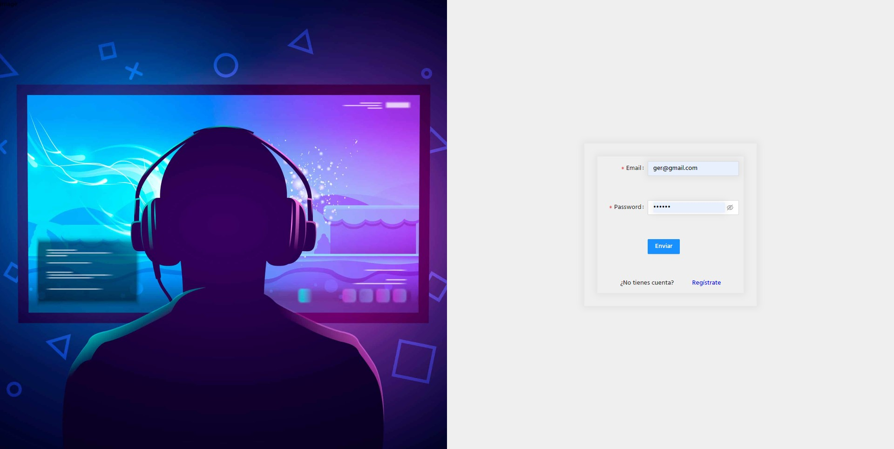
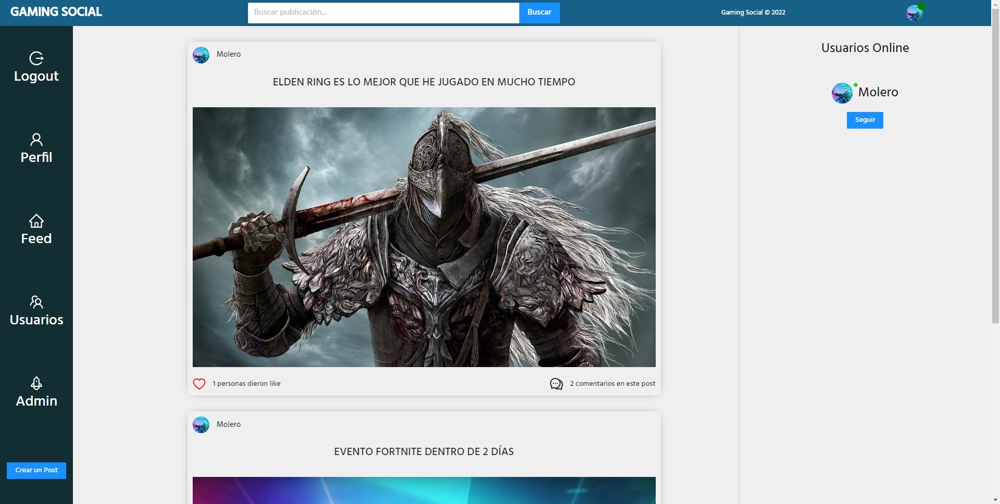
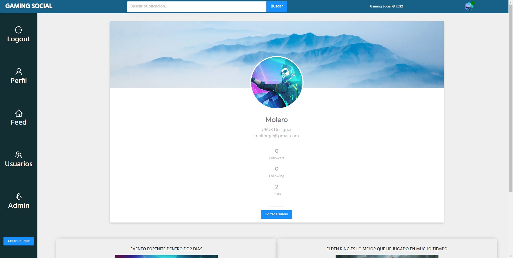
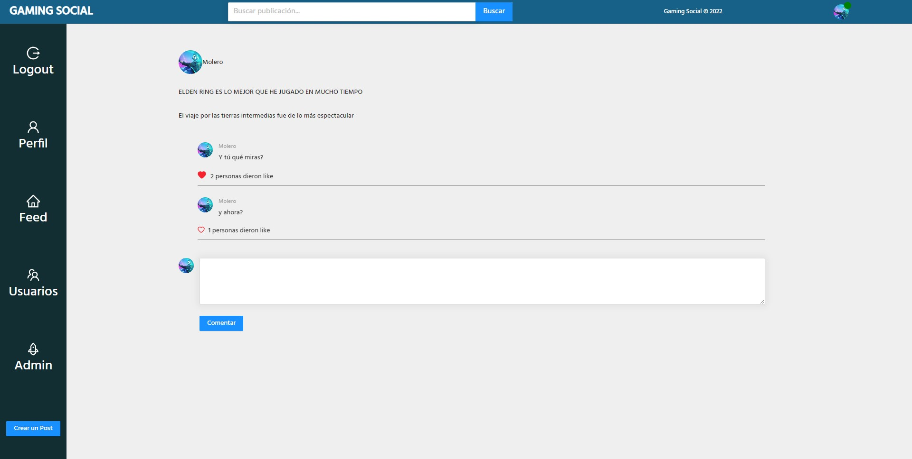

#  <center> MERN-STACK---Social-Network </center> 


[](https://postimg.cc/vD9H865p)


 ## 📑 Indice 

 - [Sobre el proyecto](#sobre-el-proyecto)

    - [Instalación y despliegue](#instalacion-y-despliegue)

    - [Tecnologías utilizadas](#tecnologias-utilizadas)
    
    - [Contenido adicional](#contenido-adicional)

- [Documentacion de API](#documentacion-de-api)


- [Retos presentados](#retos-presentados)

- [Agradecimientos](#agradecimientos)

- [Futura implementaciones](#futuras-implementaciones)

- [Autor](#autor)

<br>


# Sobre el proyecto 🙇‍♀️

### Requisitos del ejercicio
* Registro de usuarios.
* Login de usuarios.
* Que se puedan ver las publicaciones y crear nuevas.
* Que se puedan editar y eliminar las publicaciones que hace el usuario logueado
* Dar/quitar Like a post.
* Buscador de perfiles de usuario o de posts
* Que en tu perfil puedas ver tus datos y tus posts
* Que puedas comentar en las publicaciones
* Uso de ramas con git, cuando se termine el proyecto deberán quedar dos ramas la main y la develop.
* Presentación de README
* React Router
* Utilizar Redux
* Uso de SASS
* Importante el diseño
* Los componentes no podrán sobrepasar las 400 líneas de código.
* Las funciones no deberán sobrepasar las 75 líneas de código.

#### Extras
* Frontend disponible en producción (ej: Heroku).
* El usuario puede seguir a otros usuarios y tener seguidores
* CRUD de los comentarios
* Que solo puedas editar y eliminar los comentarios que tú creas.
* El usuario puede subir fotos en los posts y cambiar su foto de perfil.
* El usuario puede dar likes a los comentarios de los posts.
* El usuario en su perfil puede ver el número de seguidores y número de a cuántos sigue
* El usuario puede ver quién le sigue y a quién sigue
* Implementación de guards
* Que sea responsive

<br>


##  Instalación y despliegue 🤖

<br>

1. Clona este repositorio
```
https://github.com/Molerog/Red-Social
```

2. Instala dependencias

```
npm install
npm axios
npm antd
npm react-redux

```

3. Clona este backend

```
https://github.com/Molerog/BackendOnlineShop
```

4. Levanta el server

```
npm run dev
```

5.Abre una nueva terminal y levanta el servidor de desarrollo de React

```
npm start
```


## Tecnologías/packages utilizados ⛏️

Aquí presentamos las herramientas empleadas en este proyecto:

- [SCSS](https://sass-lang.com/)
- [React](https://es.reactjs.org/)
- [Redux](https://es.redux.js.org/)
- [Router](https://reactrouter.com/)
- [JavaScript](https://developer.mozilla.org/es/docs/Web/JavaScript)
- [AntDesign](https://ant.design/)
- [MongoDB Atlas](https://www.mongodb.com/es/cloud/atlas/efficiency/)
- [Express](https://expressjs.com/es/)
- [Node](https://nodejs.org/en/)

<br>

# Algunas Rutas 🚊

### Login



<br>

### Home



<br>

### Profile



<br>

### Post Detail




# Retos presentados 💢

El mayor reto fue comprender el funcionamiento y flujo de la información a través de redux y el empleo de useEffect pero una vez comprendido estos conceptos alcanzar los requerimientos básicos no fue un problema. 

El componente que más me costó implementar fue el de editar los post ya que quería que cuando se abriera el modal, en los inputs apareciera el contenido último que fue éscrito. Utilicé una mezcla de useState y un método de los formularios de antd para lograr esto; a su vez tuve que hacer un filter dentro del useEffect para que el algoritmo detectara la id de la publicación deseaba editar. Editar el usuario no generó tanta duda ya que al tratarse de un objeto era muy sencillo capturar su id.

<br>

# Agradecimientos 🤝


Quería agradecer especialmente a Xavi su enorme paciencia y generosidad ya que gracias a él pude solventar algún que otro quebradero de cabeza. 
También agradecer a Yorch pues siempre está dispuesto a echar una mano y también ha hecho que me ahorrara horas de mirar código

Gracias a todos los compañeros que siempre se ofrecen a ayudar en los momentos de bloqueo mental. ¡Sois unos cracks!

<br>

# Futuras implementaciones 🚀

- Poder editar y borrar comentarios así como subir imágenes con los comentarios
- Funcionalidad para detectar usuarios online
- Añadir más roles


<br>

# Autor 🐧

Germán Molero

- https://github.com/Molerog
